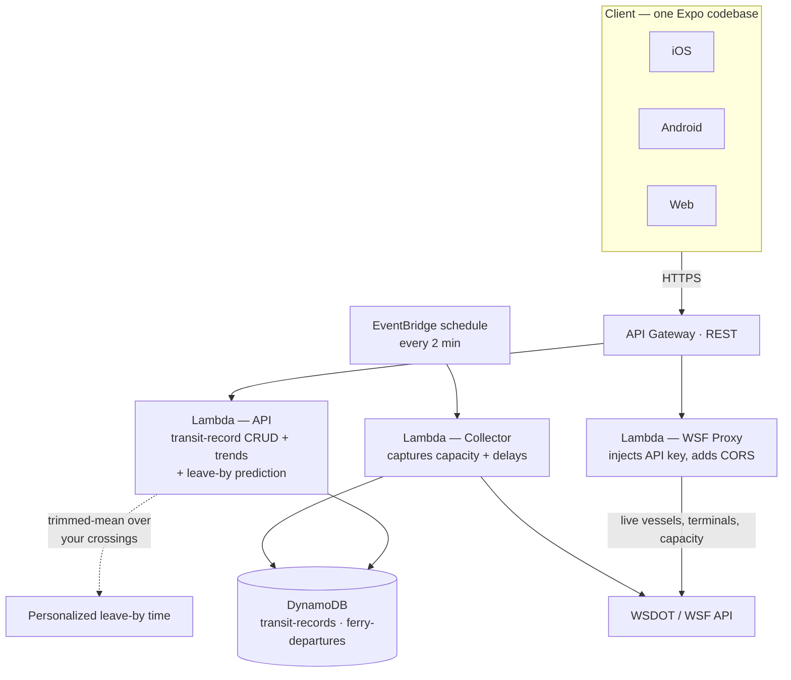

# Ferry Tracker

A React Native app for tracking Washington State Ferries in real-time. Shows upcoming departures, vessel locations, drive-up space availability, personalized departure recommendations, trend analytics, and personal transit timing.

## System Architecture

A serverless AWS backend (CDK) sits behind a single Expo codebase that ships to iOS, Android, and web. A scheduled collector continuously captures sailing data, while a proxy keeps the WSF API key server-side and solves CORS. Personalized "leave-by" times come from a trimmed-mean model over each user's own recorded crossings.



## Features

### Leave Tab
- **Large recommendation card** - prominent "leave by" time display (55% of screen)
- **Color-coded urgency** - green (plenty of time), orange (urgent), red (past due)
- **Personalized predictions** - uses your recorded commute times to calculate leave-by time (falls back to static defaults until enough data is collected)
- **Vehicle toggle** - switch between bike and car for different travel times
- **Buffer time** - adds appropriate buffer based on vehicle type; drops to 1 min floor once you have 5+ recorded trips for that route and vehicle
- **Delay awareness** - adds +5 min buffer when an active service delay alert is detected
- **Bike/walk vs. car departure timing** - walk-ons and bikes board the ferry's own departure; as a car, the card instead calls out the sailing you're actually likely to board (and the extra wait) when the boat you'd otherwise catch is expected to fill, using live drive-up capacity and historical typical-capacity data as the primary signals
- **Capacity awareness** - shows ferry fill percentage at bottom of card (suppressed when the car-wait note already states it)
- **Arrival ETA card** - compact secondary card showing estimated home/office arrival time; ETA is built from the planned (scheduled) departure time + 35-min crossing + your recorded transit time (Seattle→Bainbridge shows home ETA; Bainbridge→Seattle shows office ETA; Kingston/Edmonds routes not supported). Deviates from the schedule only when a delay is known: uses actual departure if the boat has already left, or projects departure as dock-time + 5-min turnaround if the vessel won't arrive until after its scheduled time
- **Pull-to-refresh** - pull down to refresh all data and GPS location

### Time Tab
- **Visual capacity indicator** - tank-fill animation shows how full the ferry is
- **3-zone card layout** - vessel info at top, departure time center, capacity at bottom
- **Live vessel tracking** - animated ferry icon shows incoming vessel position between terminals
- **Drive-up space availability** - large number display shows spots remaining
- **Camera viewer** - flip card to see terminal webcam feeds (WSDOT cameras)
- **Estimated departure times** - predictions based on vessel arrival + turnaround time; a unified departure model feeds the same effective time + delay to both the Next Sailing card and the "N min behind" text, so they can't disagree
- **Kingston vehicle boarding-pass notice** - a pill shown only when departing Kingston, during the published hours WSF requires a vehicle boarding pass at that terminal (there's no WSF API field for this, so it's modeled from the published seasonal schedule and renders nothing outside known seasons)
- **Car-wait chip** - surfaces when drivers are likely to be bumped to a later sailing than walk-ons/bikes, using the same signal priority as the Leave tab's car-wait note
- **Departure transition animation** - smooth animation when a ferry departs and next one takes its place
- **Combined Departed/Arriving block** - a single collapsible section (persisted via AsyncStorage) holding the last-departed card and the inbound-vessel card under one "DEPARTED · ARRIVING" header, with a "Now boarding" placeholder in the Arriving slot once the vessel docks
- **Dynamically sized Next Sailing card** - sized from measured viewport/notices/top-block heights so the Upcoming section always peeks at the bottom, accounting for whatever notices (boarding-pass pill, car-wait chip, alerts) are currently showing
- **Auto-refresh** - vessel data updates every 5 seconds, terminal data every 10 seconds
- **Pull-to-refresh** - manual refresh for all data

### Trends Tab
- **Prominent stats card** - large display of average delay and capacity
- **My Transit Times** - personal commute averages from Timer recordings
  - Filtered by selected route and direction
  - Shows trip count and average duration
- **Departure accuracy chart** - visualize how often ferries run late or early
- **Capacity chart** - see how full ferries are at departure time
- **Server-side data collection** - Lambda captures departures every 2 minutes (no app needed)

### Timer Tab
- **Large timer card** - prominent display with state-based colors
  - Blue (idle), Red (running), Orange (paused)
- **Personal transit timing** - track your commute times to improve recommendations
- **5 route options** with vehicle restrictions:
  - Home → Bainbridge Ferry (bike or car)
  - Seattle dock → Work (bike only)
  - Work → Seattle ferry (bike only)
  - Bainbridge dock → Home (bike only)
  - Home → Kingston ferry (car only)
- **Smart vehicle toggle** - only shows valid options per route
- **History view** - route-specific labels (e.g., "Home → BI Ferry")
- **Persistent storage** - times saved to backend database

### Settings Tab
- **Theme selection** - 15 team color themes with logo swatches
- **Persistent preference** - selected theme saved to AsyncStorage
- **Team logos** - ESPN logos displayed in theme picker
- **Personal locations** - optional home/work coordinates for GPS auto-routing; stored on-device only
- **Check-in contact** - optional phone number for the "Send ETA" button; stored on-device only

### Send ETA (Floating Action Button)
- **One-tap ETA message** - floating button visible on the Seattle → Bainbridge route only. When no check-in contact is saved in Settings, the button shows a "Set a contact to send ETA" reminder instead of hiding, and tapping it routes to Settings
- **Pre-populated iMessage** - opens native SMS with `⛴️ Boarded, ETA: <time>` pre-filled to the contact number set in Settings
- **ETA matches the Leave tab** - sources its ETA from `useArrivalEta`: planned (scheduled) departure time + 35-min crossing + your recorded ferry-to-home bike transit (typical stat, or 15 min default); identical to the arrival card shown on the Leave tab. Selects the sailing you're about to board — if a ferry pulled away within the last 5 minutes, that's treated as the boat you just boarded; otherwise uses the next upcoming sailing
- **Pins the boarded vessel on send** - pressing Send ETA also records a check-in (route, vessel, scheduled departure) so the displayed ETA stays locked to that sailing through the loading→departed transition, instead of jumping when the boat later shows as departed
- **Disabled when idle** - button is shown at 50% opacity and non-tappable when there is no upcoming departure
- **No backend required** - uses native `Linking.openURL` with `sms:` scheme

### Service Delay Alerts
- **Real-time bulletins** - polls WSF terminal bulletins every 60 seconds
- **Smart filtering** - shows route-specific and general alerts, hides alerts for other routes
- **Expandable banner** - red for urgent delays, blue for informational notices
- **Recommendation integration** - active delay alerts automatically add +5 min buffer to leave-by times

### GPS Auto-Routing
- **Automatic route selection** - uses device location to select the nearest ferry terminal on launch
- **Foreground refresh** - re-fetches location when the app returns to foreground
- **Manual refresh** - pull-to-refresh also updates GPS location

### Schedule Planner
- **Calendar icon entry point** - opens as a modal from the header (RouteSelector, visible on every tab)
- **Any future day** - prev/next-day stepper plus a JS-only month calendar popup (no native date-picker dependency, so it stays OTA-shippable); both are clamped to WSF's published valid date range
- **Predictive leave-by per sailing** - scheduled time minus your recorded transit time (same trimmed-mean model as the Leave tab) minus buffer, shown for each sailing on the selected day
- **"Usually ~N% full" note** - historical typical delay/capacity for that day-of-week/hour slot, reusing the Trends tab's trend data
- **Shares config with the Leave tab** - travel-time defaults and route→transit-segment mapping live in one place, so a future-day estimate and today's live recommendation never disagree

## Personalized Predictions

The Leave tab uses your recorded transit times to provide increasingly accurate leave-by recommendations.

### How It Works
1. **Record trips** - use the Timer tab to time your commutes (e.g., home to ferry terminal)
2. **Data builds up** - each recorded trip is stored in the backend database
3. **Predictions improve** - the recommendation engine applies a robust "typical" transit time based on sample size:
   - N=1: the single recorded value
   - N=2–4: median of all recorded trips
   - N≥5: 20% trimmed mean (drops top and bottom 20%, averages the middle 60%)
4. **Buffer shrinks** - once you have 5+ recorded trips for a route/vehicle, the static buffer drops to a 1-min floor
5. **Fallback defaults** - before you have data, static estimates are used

### Example
```
You have 8 recorded bike trips from work to the Seattle ferry terminal.
Trimmed mean: 10 min
Buffer: 1 min (floor applied at 5+ samples)
Active delay alert: +5 min

Leave by = Next departure time - (10 + 1 + 5) = 16 min before departure
```

The reasoning is displayed on the card, e.g., "Bike travel: 10 min (trimmed mean of 8 trips) + 1 min buffer"

### Static Fallback Times

| Route | Bike | Car |
|-------|------|-----|
| Home → Bainbridge Ferry | 7 min + 2 min buffer | 5 min + 10 min buffer |
| Seattle → Bainbridge | 10 min + 2 min buffer | N/A |
| Home → Kingston Ferry | N/A | 30 min + 20 min buffer |

## Theme System

The app supports 15 team color themes that apply across all screens. Each theme includes dark and light variants. Theme selection persists using AsyncStorage. Default theme is Seahawks.

| Theme | Primary Color | Team |
|-------|--------------|------|
| Beavers | `#DC4405` | Oregon State |
| Beavers White | `#DC4405` | Oregon State (light mode) |
| Trail Blazers | `#E03A3E` | Portland |
| Trail Blazers White | `#E03A3E` | Portland (light mode) |
| Storm | `#F9A01B` | Seattle Storm (gold) |
| Storm Green | `#2C5234` | Seattle Storm (green) |
| Seahawks | `#69BE28` | Seattle Seahawks (action green) |
| Seahawks Wild Grey | `#A5ACAF` | Seattle Seahawks (wolf grey) |
| Seahawks Rivalries | `#A5ACAF` | Seattle Seahawks (2025 wolf grey + iridescent green) |
| Sounders | `#73BE21` | Seattle Sounders (rave green) |
| Sounders Aqua | `#77C7D3` | Seattle Sounders (aqua) |
| Mariners | `#FFB81C` | Seattle Mariners (NW gold) |
| Mariners Navy | `#003278` | Seattle Mariners (navy) |
| Kraken | `#99D9D9` | Seattle Kraken (ice blue) |
| Kraken Navy | `#001F5B` | Seattle Kraken (boundless blue) |

### Architecture

1. **ThemeContext** (`src/context/ThemeContext.tsx`)
   - Provides `themeName`, `theme`, and `setTheme()` to all components
   - Persists selection to AsyncStorage (`@ferry_app_theme`)
   - Loads saved theme on app startup

2. **Theme Definitions** (`src/utils/themes.ts`)
   - Each theme defines: `primary`, `pageBg`, `cardBg`, `inputBg`, `text`, `textMuted`, `border`, etc.
   - All themes include `logoUrl` for ESPN team logos
   - White variants use light backgrounds with team accent colors for interactive elements

3. **Usage in Components**
   ```typescript
   import { useTheme } from '../context/ThemeContext';

   function MyComponent() {
     const { theme } = useTheme();
     return (
       <View style={{ backgroundColor: theme.colors.cardBg }}>
         <Text style={{ color: theme.colors.text }}>Hello</Text>
       </View>
     );
   }
   ```

### Adding a New Theme

1. Add theme name to `ThemeName` type in `themes.ts`
2. Add theme definition to `themes` object with all required color properties
3. Add to `themeNames` array

## Supported Routes

| Route | Terminals |
|-------|-----------|
| Bainbridge | Seattle (Colman Dock) ↔ Bainbridge Island |
| Kingston | Edmonds ↔ Kingston |

## Tech Stack

- **React Native** + **Expo** (SDK 54)
- **TypeScript**
- **TanStack Query** (React Query) for data fetching and caching
- **React Native Paper** for UI components
- **Expo Router** for tab navigation
- **Expo Location** for GPS-based route selection
- **react-native-gifted-charts** for trend visualizations
- **AWS CDK** for backend infrastructure (API Gateway, Lambda, DynamoDB)
- **EAS Build** for native iOS/Android builds

## Project Structure

```
ferry-app/
├── app/                          # Expo Router screens
│   ├── _layout.tsx               # Root layout with providers
│   ├── planner.tsx               # Schedule Planner modal (future-day sailings + predictive leave-by)
│   └── (tabs)/
│       ├── _layout.tsx           # Tab navigator with route selector header
│       ├── index.tsx             # Time screen
│       ├── recommend.tsx         # Leave screen (recommendation + arrival ETA card)
│       ├── trends.tsx            # Trends/analytics screen
│       ├── timer.tsx             # Transit timer screen
│       └── settings.tsx          # Settings + theme selection
│
├── src/
│   ├── api/
│   │   ├── backend.ts            # Backend API client (trends, transit records)
│   │   ├── client.ts             # Axios instances for WSF APIs
│   │   ├── schedule.ts           # Schedule API (today's schedule, schedule-for-date, valid date range)
│   │   ├── types.ts              # TypeScript interfaces for WSF data
│   │   ├── vessels.ts            # Vessel locations API
│   │   └── terminals.ts          # Terminal sailing space API
│   │
│   ├── components/
│   │   ├── AlertBanner.tsx       # Service delay alert banner
│   │   ├── ArrivingCard.tsx      # Inbound-vessel card (part of the Departed/Arriving block)
│   │   ├── CapacityBar.tsx       # Animated capacity fill bar
│   │   ├── CarWaitChip.tsx       # Notice when drivers face a later sailing than walk-ons/bikes
│   │   ├── CheckInFAB.tsx        # Send ETA floating action button
│   │   ├── FerryCard.tsx         # Compact departure card
│   │   ├── FerryProgressIndicator.tsx  # Vessel position between terminals
│   │   ├── KingstonBoardingPassPill.tsx  # Vehicle boarding-pass notice for Kingston departures
│   │   ├── LastDepartureCard.tsx  # Recently departed ferry card
│   │   ├── MainDepartureCard.tsx  # Large flippable main departure card
│   │   ├── MonthCalendar.tsx     # JS-only month calendar popup for the Schedule Planner (no native date-picker dep)
│   │   └── RouteSelector.tsx     # Route/direction picker header + planner entry point
│   │
│   ├── context/
│   │   ├── RouteContext.tsx      # Shared route state across tabs
│   │   └── ThemeContext.tsx      # Theme state + persistence
│   │
│   ├── hooks/
│   │   ├── useDailyTrends.ts     # Trend data management
│   │   ├── useArrivalEta.ts      # Arrival ETA from next departure + typical transit time
│   │   ├── useCarWait.ts          # Car-vs-walk/bike departure timing estimate
│   │   ├── useFutureSchedule.ts   # Future-day schedule + valid date range (Schedule Planner)
│   │   ├── useLatestDeparture.ts  # Backend departure data for capacity
│   │   ├── useNextDepartures.ts   # Combined departure data
│   │   ├── useRecommendation.ts   # Leave-by time calculations
│   │   ├── useTerminalBulletins.ts # Service delay alerts
│   │   ├── useTerminalConditions.ts # Terminal data polling (10s)
│   │   ├── useTerminalWaitTimes.ts # WSF terminalwaittimes polling (car-wait signal)
│   │   ├── useTimer.ts            # Timer state management
│   │   ├── useTransitRecords.ts   # Transit time CRUD
│   │   ├── useUserLocation.ts     # GPS location with foreground refresh
│   │   └── useVesselLocations.ts  # Real-time vessel polling (5s)
│   │
│   ├── types/
│   │   ├── location.ts           # KnownLocation type (shared by utils/locations and store/personalLocations)
│   │   └── storage.ts            # Storage data types
│   │
│   └── utils/
│       ├── arrivalEtaLogic.ts    # Pure ETA functions (selectActiveDeparture, etaDepartureBasis, projectedDockTime)
│       ├── carWait.ts            # Car-vs-walk/bike wait estimator (waittimes notes → alerts → live capacity → history)
│       ├── constants.ts          # Terminal IDs, route config, ETA constants
│       ├── dateHelpers.ts        # Date-only helpers for the Schedule Planner (day math, formatting, clamping)
│       ├── ferryDeparture.ts     # Unified effective departure time + delay model (feeds Time + Leave cards)
│       ├── kingstonBoardingPass.ts  # Kingston vehicle boarding-pass seasonal schedule logic
│       ├── planEstimate.ts       # Predictive leave-by for a future sailing (Schedule Planner)
│       ├── themes.ts             # Theme definitions (15 themes)
│       ├── time.ts               # Date parsing and formatting
│       ├── transitConfig.ts      # Shared travel-time defaults + route→transit-segment map (Leave card + Planner)
│       ├── transitStats.ts       # Robust "typical" transit time (raw/median/trimmed-mean)
│       └── typicalConditions.ts  # Historical typical delay/capacity for a route+day/hour slot (trimmed mean, outlier-resistant)
│
├── infra/                        # AWS CDK infrastructure
│   ├── lib/infra-stack.ts        # CDK stack definition
│   └── lambda/
│       ├── api/index.ts          # REST API (trends, transit records)
│       ├── collector/index.ts    # Scheduled departure data collector
│       └── proxy/index.ts        # WSF API CORS proxy
│
├── eas.json                      # EAS Build config
└── .env                          # API keys (not committed)
```

## WSF API Integration

The app uses Washington State Ferries APIs:

### Vessel Locations API
```
GET /ferries/api/vessels/rest/vessellocations
```
- Real-time vessel positions, updated every 5 seconds
- Contains: vessel name, location, ETA, departure time, at-dock status

### Terminal Sailing Space API
```
GET /ferries/api/terminals/rest/terminalsailingspace
```
- Scheduled departures with space availability
- Contains: departure times, vessel assignments, drive-up/reservation spots

### Terminal Bulletins API
- Service delay alerts, cancellations, and general notices
- Polled every 60 seconds
- Keywords trigger alert classification: cancel, delay, behind schedule, out of service, emergency

### Terminal Wait Times API
```
GET /ferries/api/terminals/rest/terminalwaittimes/{terminalId}
```
- One of the signals feeding the car-wait estimate (Leave tab note + Time tab `CarWaitChip`)
- WSF's wait-time notes are static "advance arrival recommended" advisories rather than live wait figures, so this signal is usually dormant in practice — car-wait relies mainly on live drive-up capacity and historical typical-capacity data, in that priority order

### Schedule API (Planner)
```
GET /ferries/api/schedule/rest/schedule/{TripDate}/{DepartingTerminalID}/{ArrivingTerminalID}
GET /ferries/api/schedule/rest/validdaterange
```
- Powers the Schedule Planner's future-day sailing list and its date-range clamping
- Proxied at `/wsf/schedule-date/{tripDate}/{departingTerminalId}/{arrivingTerminalId}` and `/wsf/schedule-validrange`
- Client: `fetchScheduleForDate` / `fetchValidDateRange` (`src/api/schedule.ts`), consumed via `useFutureSchedule` / `useValidDateRange` (`src/hooks/useFutureSchedule.ts`)

### Terminal IDs
```typescript
SEATTLE: 7       // Colman Dock
BAINBRIDGE: 3    // Bainbridge Island
KINGSTON: 12     // Kingston
EDMONDS: 8       // Edmonds
```

## Status Logic

The app determines departure status by matching real-time vessel data to scheduled sailings:

| Status | Condition |
|--------|-----------|
| **Scheduled** | Future departure, vessel not yet at terminal |
| **Arriving** | Vessel en route TO the departure terminal |
| **Loading** | Vessel at dock, matches scheduled departure time |
| **Departed** | Vessel has left dock for this sailing |

### Estimated Departure
When a vessel won't dock until after its scheduled departure (i.e. it's genuinely late), the app calculates:
```
Estimated Departure = Vessel ETA + 5 min turnaround
```
A vessel that docks before its scheduled time keeps the planned departure — the schedule already budgets the normal turnaround.

## Backend Infrastructure

The backend runs on AWS (CDK-managed):

- **API Gateway** - REST API for trends, transit records, and WSF proxy
- **Lambda (API)** - handles CRUD for transit records and serves trend data
- **Lambda (Collector)** - runs every 2 minutes, captures departure data (capacity, delays) to DynamoDB
- **Lambda (Proxy)** - forwards WSF API requests with API key, adds CORS headers
- **DynamoDB** - two tables: `ferry-departures` (trends) and `transit-records` (timer data)

## Running Locally

### Prerequisites
- Node.js 18+
- Expo CLI: `npm install -g expo-cli`
- iOS Simulator (Xcode) or Android Emulator (Android Studio)

### Setup
```bash
cd ferry-app
npm install

# Create .env file with your WSF API key
echo "EXPO_PUBLIC_WSF_API_KEY=your_key_here" > .env
```

### Development
```bash
# Start Expo dev server
npx expo start

# Then press:
# i - Open iOS Simulator
# a - Open Android Emulator
# w - Open in web browser (has CORS issues)
```

### Web Note
The WSF API doesn't support CORS, so web browser testing won't work locally. Use iOS Simulator, Android Emulator, or Expo Go on a physical device.

## Building & Deployment

### Backend (AWS CDK)
```bash
cd infra
npm install
npm run deploy
```

After deployment, copy the API URL from the output and add it to your `.env` file.

### Native (EAS Build)
```bash
# Login to Expo
eas login

# Build for iOS (installable via QR code)
eas build --profile preview --platform ios

# Build for Android
eas build --profile preview --platform android
```

## Configuration

Get a free WSF API key at: https://wsdot.wa.gov/traffic/api/

Add to `.env`:
```
EXPO_PUBLIC_WSF_API_KEY=your-key-here
EXPO_PUBLIC_API_URL=https://your-api-id.execute-api.us-west-2.amazonaws.com/prod
EXPO_APPLE_ID=your-apple-id@example.com   # required for eas submit
```

## License

MIT
