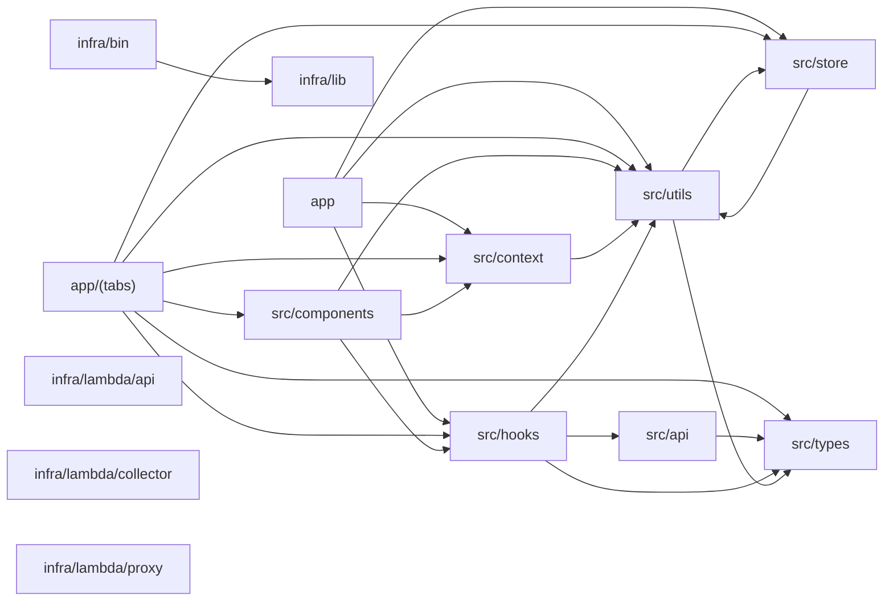

# Architecture overview — System Spec

Repo-level view of how the source folders depend on each other, aggregated from the import graph. An arrow A → B means a file in A imports a file in B.

## Module dependency graph

## Cross-refs

- [`INDEX.md`](../INDEX.md)
