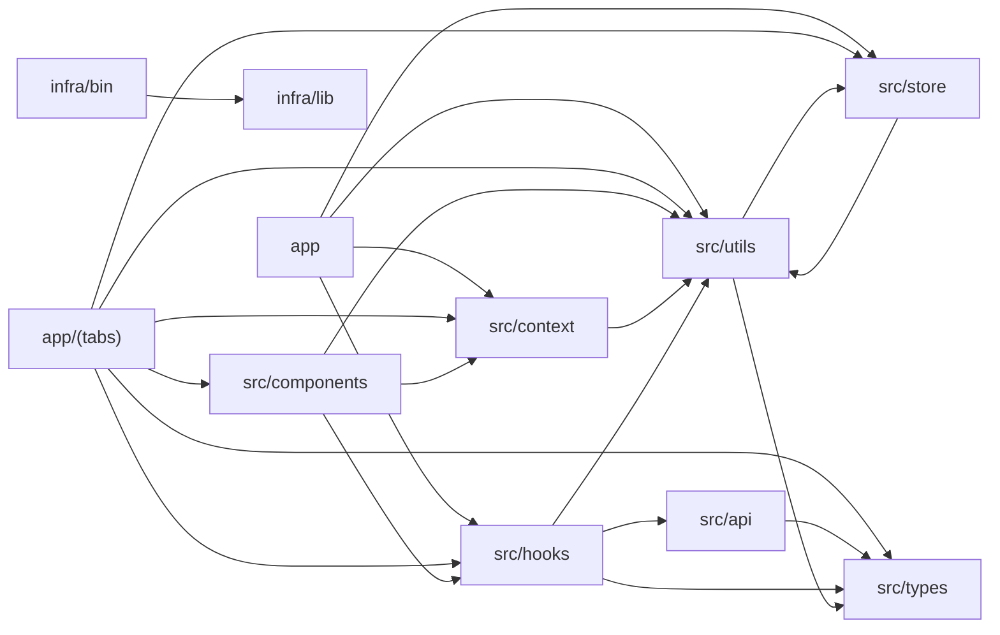

# Architecture overview — System Spec

Repo-level view of how the source folders depend on each other, aggregated from the import graph. An arrow A → B means a file in A imports a file in B.

## Module dependency graph

Folders that import across folder boundaries (11 of 14). Self-contained folders are listed below.

## Standalone modules (3)

Folders with no cross-folder imports — self-contained (e.g. individual Lambdas, scripts, leaf utilities).

- `infra/lambda/api`
- `infra/lambda/collector`
- `infra/lambda/proxy`

## Cross-refs

- [`INDEX.md`](../INDEX.md)
