# Frontend architecture — System Spec

Cross-cutting view of how the app is wired: which contexts exist, which files consume them, and which custom hooks see widespread use.

## Architecture

```mermaid
flowchart TD
  App["App (screens + components)"]
  App --> ctx_RouteContext["RouteContext — 7 consumers"]
  App --> ctx_ThemeContext["ThemeContext — 16 consumers"]
  App -.-> hook_useArrivalEta["useArrivalEta — 2 consumers"]
  App -.-> hook_useCarWait["useCarWait — 2 consumers"]
  App -.-> hook_useDailyTrends["useDailyTrends — 3 consumers"]
  App -.-> hook_useFutureSchedule["useFutureSchedule — 1 consumer"]
  App -.-> hook_useLatestDeparture["useLatestDeparture — 1 consumer"]
  App -.-> hook_useNextDepartures["useNextDepartures — 8 consumers"]
  App -.-> hook_useRecommendation["useRecommendation — 1 consumer"]
  App -.-> hook_useTerminalBulletins["useTerminalBulletins — 4 consumers"]
  App -.-> hook_useTerminalConditions["useTerminalConditions — 1 consumer"]
  App -.-> hook_useTerminalWaitTimes["useTerminalWaitTimes — 1 consumer"]
  App -.-> hook_useTimer["useTimer — 1 consumer"]
  App -.-> hook_useTransitRecords["useTransitRecords — 5 consumers"]
  App -.-> hook_useUserLocation["useUserLocation — 2 consumers"]
  App -.-> hook_useVesselLocations["useVesselLocations — 1 consumer"]
```

## Contexts (2)

| Context | Exports | Consumers |
|---|---|---|
| [`RouteContext.tsx`](../src/context/RouteContext.md) | `RouteProvider`, `useRoute`, `ROUTE_GROUP_LABELS` | 7 files |
| [`ThemeContext.tsx`](../src/context/ThemeContext.md) | `ThemeProvider`, `useTheme` | 16 files |

## Custom hooks (14)

| Hook | Consumers |
|---|---|
| [`useArrivalEta.ts`](../src/hooks/useArrivalEta.md) | 2 files |
| [`useCarWait.ts`](../src/hooks/useCarWait.md) | 2 files |
| [`useDailyTrends.ts`](../src/hooks/useDailyTrends.md) | 3 files |
| [`useFutureSchedule.ts`](../src/hooks/useFutureSchedule.md) | 1 files |
| [`useLatestDeparture.ts`](../src/hooks/useLatestDeparture.md) | 1 files |
| [`useNextDepartures.ts`](../src/hooks/useNextDepartures.md) | 8 files |
| [`useRecommendation.ts`](../src/hooks/useRecommendation.md) | 1 files |
| [`useTerminalBulletins.ts`](../src/hooks/useTerminalBulletins.md) | 4 files |
| [`useTerminalConditions.ts`](../src/hooks/useTerminalConditions.md) | 1 files |
| [`useTerminalWaitTimes.ts`](../src/hooks/useTerminalWaitTimes.md) | 1 files |
| [`useTimer.ts`](../src/hooks/useTimer.md) | 1 files |
| [`useTransitRecords.ts`](../src/hooks/useTransitRecords.md) | 5 files |
| [`useUserLocation.ts`](../src/hooks/useUserLocation.md) | 2 files |
| [`useVesselLocations.ts`](../src/hooks/useVesselLocations.md) | 1 files |

## Cross-refs

- [`src/context/_module.md`](../src/context/_module.md)
- [`src/hooks/_module.md`](../src/hooks/_module.md)
