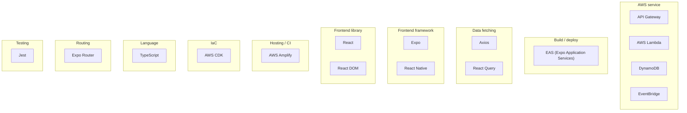

# Technology stack — System Spec

What this system is built from — frameworks, languages, tooling, and cloud services — detected from dependencies, config files, AWS SDK / CDK imports, and the SAM template.

## Stack

## Inventory

| Technology | Category | Detected from |
|---|---|---|
| API Gateway | AWS service | import `aws-cdk-lib/aws-apigateway` |
| AWS Lambda | AWS service | import `aws-cdk-lib/aws-lambda-nodejs`, import `aws-cdk-lib/aws-lambda` |
| DynamoDB | AWS service | import `@aws-sdk/client-dynamodb`, import `@aws-sdk/lib-dynamodb`, import `aws-cdk-lib/aws-dynamodb` |
| EventBridge | AWS service | import `aws-cdk-lib/aws-events-targets`, import `aws-cdk-lib/aws-events` |
| EAS (Expo Application Services) | Build / deploy | `eas.json` |
| Axios | Data fetching | dep `axios` |
| React Query | Data fetching | dep `@tanstack/react-query` |
| Expo | Frontend framework | `app.json`, dep `expo` |
| React Native | Frontend framework | dep `react-native` |
| React | Frontend library | dep `react` |
| React DOM | Frontend library | dep `react-dom` |
| AWS Amplify | Hosting / CI | `amplify.yml` |
| AWS CDK | IaC | dep `aws-cdk-lib`, dep `aws-cdk`, dep `constructs` |
| TypeScript | Language | dep `typescript` |
| Expo Router | Routing | dep `expo-router` |
| Jest | Testing | `jest.config.js`, dep `jest`, dep `ts-jest` |

## Cross-refs

- [`INDEX.md`](../INDEX.md)
